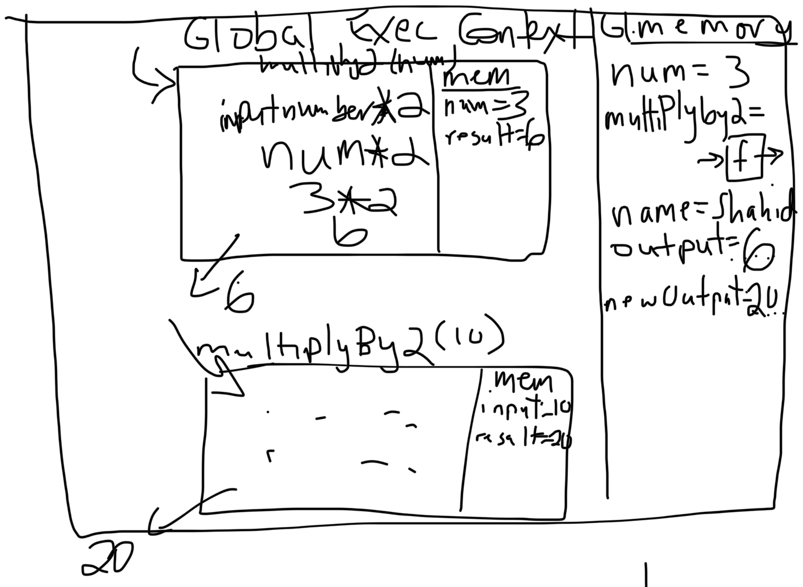
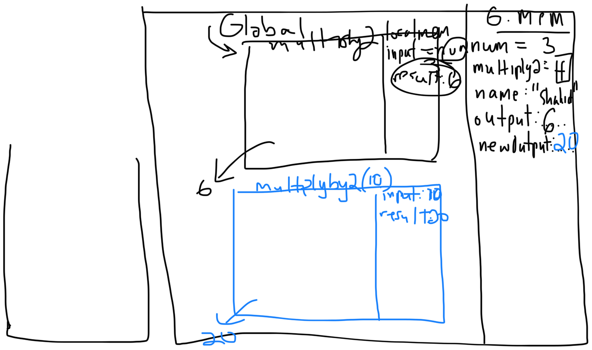

# JavaScript: Execution Context and the Call Stack

What happens when code is run?
JavaScript Engine is interpreting our code
V8 engine in Chrome

- code is parsed through line by line
- stores things in memory by going line by line
- thread of execution

When we run our code, we create a 'global execution context'

- thread of execution
- live memory of variables (global variable environment)

```javascript=
const number = 5; // first line
function addTwo(input) {
  // function declaration
  const result = input + 5;
  return result;
}
const fruit = "apple";
```

- `addTwo` is stored as a function definition, it is not invoked
  global execution context comprises all the code for the particular execution of JavaScript (Web browser/Node.js)
- functions also have their own execution context when they're invoked
- global memory is available everywhere
- thread of execution going through your code
- "global variable environment"

Thread of Execution:

- one thing at a time, single threaded
  - when you execute a function, everything else is stopped
- synchronous (in top to bottom order)

Function:

- defining instructions for a set of code

```javascript=
const num = 3;
function multiplyBy2(inputNumber) {
  const result = inputNumber * 2;
  return result;
}
const name = "Shahid";
const output = multiplyBy2(num);
const newOutput = multiplyBy2(10);
```

## Call Stack

- Stack data structure
- Global context is at the bottom
- Function calls are added to the stack
- Function calls are pushed on and popped off

## Whiteboard





